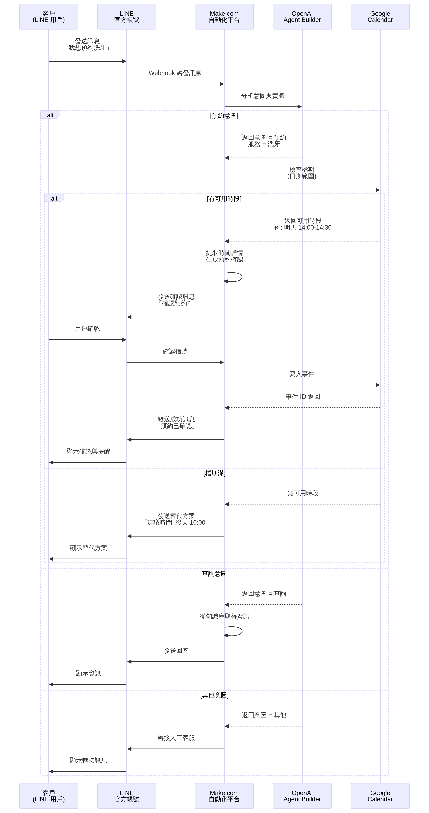
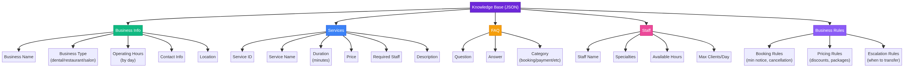
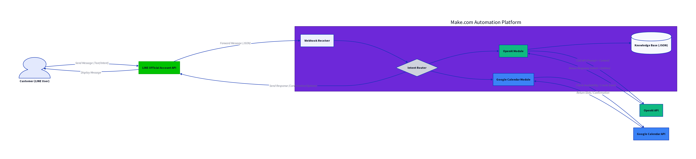

# AI 智能客服 / Agent 模版租賃 - 系統架構設計文件

**版本**：1.0  
**日期**：2026-04-15  
**作者**：Manus AI  
**狀態**：Phase 2 - 架構設計完成

---

## 目錄

1. [系統架構概述](#系統架構概述)
2. [核心組件設計](#核心組件設計)
3. [預約工作流程](#預約工作流程)
4. [知識庫結構](#知識庫結構)
5. [資料流與整合](#資料流與整合)
6. [技術棧決策](#技術棧決策)
7. [部署架構](#部署架構)

---

## 系統架構概述

### 高層架構

本系統採用**微服務編排模式**，通過 Make.com 作為中央協調平台，連接 LINE 官方帳號、OpenAI Agent、Google Calendar 與客戶知識庫，實現完全無代碼的 AI 客服自動化。

```
客戶 (LINE) → LINE API → Make.com → OpenAI Agent → Google Calendar
                          ↓
                    知識庫 (JSON)
```

### 系統特性

| 特性 | 說明 |
|------|------|
| **無代碼部署** | 完全通過 Make.com 視覺化工作流實現，無需編寫代碼 |
| **多行業支援** | 預設模版支援牙醫、餐廳、美髮沙龍等行業 |
| **即時檔期同步** | 與 Google Calendar 實時同步，避免雙重預約 |
| **自然語言理解** | 使用 OpenAI 進行意圖識別與實體提取 |
| **可擴展知識庫** | JSON 格式知識庫，易於客戶自訂與更新 |
| **24/7 可用性** | 自動應答常見問題，超出範圍自動轉接人工 |

---

## 核心組件設計

### 1. LINE 官方帳號 API

**職責**：訊息入口與出口

**功能**：
- 接收客戶訊息（文字、圖片、位置）
- 發送自動回覆與預約確認
- 支援快速回覆按鈕與圖文選單

**優勢**：
- 台灣用戶滲透率最高（>90% 的 15-49 歲用戶）
- 官方帳號認證機制，建立信任
- 支援 Rich Menu 與 Flex Message 進階排版

**配置流程**：
```
1. 客戶在 LINE 官方帳號管理後台建立帳號
2. 獲取 Channel ID 與 Channel Access Token
3. 在 Make.com 中配置 LINE 模組
4. 設定 Webhook URL 指向 Make.com
5. 測試訊息流向
```

### 2. Make.com 自動化平台

**職責**：工作流編排與資料轉換

**核心模組**：

#### 2.1 Webhook 接收器
```
功能：接收 LINE 訊息
輸入：LINE 事件 JSON
輸出：標準化訊息物件 {
  user_id: "U123...",
  message_text: "我想預約洗牙",
  timestamp: "2026-04-15T10:30:00Z"
}
```

#### 2.2 意圖路由器
```
功能：根據訊息意圖分發到不同流程
邏輯：
IF 訊息包含 ["預約", "掛號", "訂位"] → 預約流程
ELSE IF 訊息包含 ["營業", "時間", "地點"] → 查詢流程
ELSE IF 訊息包含 ["價格", "費用", "多少錢"] → 價格查詢流程
ELSE → 轉接人工客服
```

#### 2.3 OpenAI 模組
```
功能：自然語言處理與意圖識別
輸入：原始訊息文本
處理：
1. 呼叫 OpenAI API（使用 GPT-4 或更新版本）
2. 提供系統 Prompt：
   "你是一個客服助手，需要從訊息中提取：
   - 意圖 (booking/query/complaint)
   - 服務項目 (service_type)
   - 偏好日期 (preferred_date)
   - 偏好時間 (preferred_time)
   返回 JSON 格式結果"
3. 解析 AI 回應
輸出：結構化實體 {
  intent: "booking",
  service: "teeth_cleaning",
  date: "2026-04-16",
  time: "14:00"
}
```

#### 2.4 Google Calendar 模組
```
功能：檢查檔期與寫入預約
操作：
1. 檢查可用性：
   GET /calendar/freebusy
   參數：日期範圍、服務時長
2. 建立事件：
   POST /calendar/events
   參數：事件名稱、時間、參與者、描述
3. 更新事件：
   PATCH /calendar/events/{eventId}
4. 刪除事件：
   DELETE /calendar/events/{eventId}
```

### 3. OpenAI Agent Builder

**職責**：AI 對話邏輯與決策

**工作流節點**：

```
┌─────────────────────────────────────────────────────────┐
│ 1. 接收訊息節點 (Input Node)                             │
│    輸入：客戶訊息                                         │
└──────────────────┬──────────────────────────────────────┘
                   ↓
┌─────────────────────────────────────────────────────────┐
│ 2. 意圖分析節點 (Agent Node)                             │
│    Prompt: "分析訊息意圖並提取實體"                      │
│    輸出：{intent, entities, confidence}                 │
└──────────────────┬──────────────────────────────────────┘
                   ↓
┌─────────────────────────────────────────────────────────┐
│ 3. 路由決策節點 (Router Node)                            │
│    IF intent == "booking" → 預約分支                    │
│    ELSE IF intent == "query" → 查詢分支                 │
│    ELSE → 轉接分支                                       │
└──────────────────┬──────────────────────────────────────┘
                   ↓
┌─────────────────────────────────────────────────────────┐
│ 4a. 預約分支 (Booking Branch)                           │
│    - 檢查 Google Calendar 檔期                           │
│    - 確認預約詳情                                        │
│    - 寫入日曆事件                                        │
│    - 發送確認訊息                                        │
└──────────────────┬──────────────────────────────────────┘
                   ↓
┌─────────────────────────────────────────────────────────┐
│ 5. 輸出節點 (Output Node)                               │
│    輸出：回覆訊息 + 後續動作                             │
└─────────────────────────────────────────────────────────┘
```

### 4. 知識庫系統

**格式**：JSON 結構化資料

**用途**：
- 儲存業務資訊（營業時間、服務項目、員工資訊）
- 提供 FAQ 回答
- 定義業務規則（預約最小提前時間、取消政策等）

**存儲位置**：
- 開發環境：Make.com 資料存儲
- 生產環境：Google Drive / AWS S3（可選）

---

## 預約工作流程

### 完整流程圖



### 流程詳解

#### 步驟 1：訊息接收
```
客戶在 LINE 傳送：「我想預約明天洗牙」
↓
LINE API 接收訊息
↓
Make.com Webhook 觸發
```

#### 步驟 2：意圖分析
```
Make.com 呼叫 OpenAI Agent
Prompt: "分析以下訊息的意圖"
輸入: "我想預約明天洗牙"
↓
OpenAI 返回：
{
  "intent": "booking",
  "service": "teeth_cleaning",
  "date": "2026-04-16",
  "time": null,  // 未指定
  "confidence": 0.95
}
```

#### 步驟 3：檔期檢查
```
Make.com 呼叫 Google Calendar API
GET /freebusy
參數：
- calendar_id: "dentist@example.com"
- time_min: "2026-04-16T09:00:00Z"
- time_max: "2026-04-16T18:00:00Z"
- duration: 30 分鐘（洗牙時長）

↓
Google Calendar 返回可用時段：
[
  "2026-04-16T10:00:00Z",
  "2026-04-16T14:00:00Z",
  "2026-04-16T16:00:00Z"
]
```

#### 步驟 4：確認與預約
```
Make.com 組織確認訊息
發送至 LINE：
"明天有以下時段可預約洗牙：
 • 10:00-10:30
 • 14:00-14:30
 • 16:00-16:30
 請選擇或回覆您的偏好時間"

↓
客戶選擇：「14:00」

↓
Make.com 呼叫 Google Calendar API
POST /calendar/events
{
  "summary": "洗牙 - 客戶名稱",
  "start": {"dateTime": "2026-04-16T14:00:00+08:00"},
  "end": {"dateTime": "2026-04-16T14:30:00+08:00"},
  "description": "LINE 預約 - 客戶 ID: U123...",
  "attendees": [{"email": "patient@example.com"}]
}

↓
Google Calendar 返回事件 ID
```

#### 步驟 5：確認回覆
```
Make.com 發送確認訊息至 LINE：
"✅ 預約成功！
 服務：洗牙
 日期：2026-04-16 (明天)
 時間：14:00-14:30
 地點：笑容牙醫診所
 
 提醒：請於預約時間前 10 分鐘到達
 取消預約：回覆『取消』"
```

### 異常情況處理

#### 情況 1：檔期滿
```
Google Calendar 返回空陣列
↓
Make.com 發送替代方案：
"明天檔期已滿，建議時段：
 • 後天 (2026-04-17) 10:00
 • 後天 (2026-04-17) 14:00
 是否接受？"
```

#### 情況 2：超出營業時間
```
客戶要求：「晚上 20:00 預約」
↓
OpenAI 識別時間為 20:00
↓
Make.com 檢查營業時間規則：
   營業時間：09:00-18:00
   20:00 > 18:00 → 超出範圍
↓
發送訊息：
"抱歉，我們的營業時間是 09:00-18:00
 請選擇營業時間內的時段"
```

#### 情況 3：轉接人工客服
```
客戶訊息：「我想投訴上次的服務」
↓
OpenAI 識別意圖為 "complaint"
↓
Make.com 觸發轉接流程：
1. 發送訊息：「感謝您的反饋，我將轉接給專人處理」
2. 在 LINE 官方帳號標記為「待人工回覆」
3. 發送通知給店家客服人員
```

---

## 知識庫結構

### 完整架構圖



### JSON 範例

```json
{
  "business_info": {
    "name": "笑容牙醫診所",
    "type": "dental_clinic",
    "phone": "02-1234-5678",
    "address": "台北市信義區信義路五段 100 號",
    "website": "https://example.com",
    "operating_hours": {
      "monday_to_friday": {
        "open": "09:00",
        "close": "18:00"
      },
      "saturday": {
        "open": "09:00",
        "close": "14:00"
      },
      "sunday": "closed"
    }
  },
  
  "services": [
    {
      "id": "cleaning",
      "name": "洗牙",
      "duration_minutes": 30,
      "price": 500,
      "description": "專業牙齒清潔與結石清除",
      "required_staff": ["dentist", "hygienist"]
    },
    {
      "id": "filling",
      "name": "補牙",
      "duration_minutes": 45,
      "price": 1500,
      "description": "蛀牙填補與修復",
      "required_staff": ["dentist"]
    },
    {
      "id": "implant",
      "name": "植牙",
      "duration_minutes": 120,
      "price": 25000,
      "description": "人工牙根植入",
      "required_staff": ["dentist"]
    }
  ],
  
  "staff": [
    {
      "id": "dr_wang",
      "name": "王醫生",
      "title": "牙醫師",
      "specialties": ["implant", "cosmetic"],
      "available_hours": {
        "monday_to_friday": ["09:00-12:00", "14:00-18:00"],
        "saturday": ["09:00-14:00"]
      },
      "max_clients_per_day": 12
    },
    {
      "id": "hygienist_lee",
      "name": "李衛生員",
      "title": "牙科衛生員",
      "specialties": ["cleaning", "xray"],
      "available_hours": {
        "monday_to_friday": ["09:00-18:00"],
        "saturday": ["09:00-14:00"]
      },
      "max_clients_per_day": 16
    }
  ],
  
  "faq": [
    {
      "id": "faq_001",
      "question": "首次就診需要帶什麼？",
      "answer": "請帶健保卡、身分證與保險卡。如有其他醫療紀錄，也請一併攜帶。",
      "category": "booking"
    },
    {
      "id": "faq_002",
      "question": "可以刷卡嗎？",
      "answer": "可以。我們接受現金、信用卡與 LINE Pay。",
      "category": "payment"
    },
    {
      "id": "faq_003",
      "question": "如何取消預約？",
      "answer": "請在預約時間前 24 小時回覆『取消』，或致電 02-1234-5678。",
      "category": "booking"
    }
  ],
  
  "business_rules": {
    "booking": {
      "min_advance_notice_hours": 2,
      "max_advance_booking_days": 30,
      "cancellation_policy": "預約前 24 小時可免費取消"
    },
    "pricing": {
      "first_time_discount": 0.1,
      "package_discount": {
        "3_sessions": 0.05,
        "6_sessions": 0.1
      }
    },
    "escalation": {
      "transfer_keywords": ["投訴", "問題", "不滿", "退款"],
      "transfer_message": "感謝您的反饋，我將轉接給專人處理"
    }
  }
}
```

---

## 資料流與整合

### 完整系統架構圖



### API 整合矩陣

| 來源 | 目標 | 資料型態 | 頻率 | 延遲 |
|------|------|---------|------|------|
| LINE API | Make.com | JSON (訊息) | 即時 | <1s |
| Make.com | OpenAI API | JSON (Prompt) | 按需 | 1-3s |
| OpenAI API | Make.com | JSON (回應) | 按需 | 1-3s |
| Make.com | Google Calendar | JSON (事件) | 按需 | <2s |
| Google Calendar | Make.com | JSON (檔期) | 按需 | <2s |
| Make.com | LINE API | JSON (訊息) | 即時 | <1s |

### 資料安全性

| 層級 | 措施 |
|------|------|
| **傳輸層** | HTTPS + TLS 1.2 |
| **認證層** | OAuth 2.0 (Google Calendar) + LINE Channel Token |
| **資料層** | 敏感資訊加密存儲 (客戶電話、Email) |
| **日誌層** | 審計日誌記錄所有 API 呼叫 |

---

## 技術棧決策

### 為什麼選擇這些技術？

| 技術 | 選擇原因 | 替代方案 | 為何不選 |
|------|---------|---------|---------|
| **Make.com** | 無代碼、3000+ 應用整合、成本低 | Zapier、n8n | Zapier 定價高、n8n 需自主部署 |
| **OpenAI Agent** | 視覺化工作流、無需編碼、可部署 | LangChain、LlamaIndex | 需要開發能力、部署複雜 |
| **Google Calendar** | 業界標準、易於同步、免費配額充足 | Outlook、Calendly | Outlook 整合複雜、Calendly 定價高 |
| **LINE API** | 台灣用戶滲透率最高 | WhatsApp、Facebook | WhatsApp 需商業認證、FB 整合複雜 |

### 成本分析

**每月成本估算**（假設 1,000 次預約）：

| 服務 | 用量 | 單價 | 月費 |
|------|------|------|------|
| Make.com | 1,000 次操作 | $0.5/100 | $5 |
| OpenAI API | 1,000 次呼叫 | $0.001/次 | $1 |
| Google Calendar | 無限 | 免費 | $0 |
| LINE API | 無限 | 免費 | $0 |
| **合計** | | | **$6/月** |

**客戶月租 vs 成本**：
- 基礎版：NT$2,990（成本 NT$180 ≈ 6%）
- 專業版：NT$5,990（成本 NT$180 ≈ 3%）
- 企業版：NT$12,990（成本 NT$180 ≈ 1.4%）

---

## 部署架構

### 部署流程圖

```
1. 客戶簽約
   ↓
2. 提供配置表單
   ├─ 業務類型 (牙醫/餐廳/沙龍)
   ├─ 營業時間
   ├─ 服務項目
   ├─ 員工資訊
   └─ Google Calendar ID
   ↓
3. 在 Make.com 部署預設工作流
   ├─ 複製模版
   ├─ 配置 LINE 模組 (Channel Token)
   ├─ 配置 Google Calendar 模組 (OAuth)
   ├─ 配置 OpenAI 模組 (API Key)
   └─ 上傳知識庫 JSON
   ↓
4. 測試
   ├─ 發送測試訊息
   ├─ 驗證預約流程
   ├─ 檢查日曆同步
   └─ 確認回覆訊息
   ↓
5. 上線
   ├─ 啟用 Webhook
   ├─ 設定 LINE 快速回覆
   ├─ 配置自動回覆訊息
   └─ 發送客戶上線通知
   ↓
6. 監控與優化
   ├─ 每日監控對話量
   ├─ 每週分析失敗原因
   ├─ 每月優化知識庫
   └─ 每季評估效果
```

### 環境配置

#### 開發環境
```
Make.com Workspace: "AaaS-Development"
- 所有模組使用沙箱模式
- 測試 LINE Channel Token
- 測試 Google Calendar (個人日曆)
- 測試 OpenAI API Key
```

#### 生產環境
```
Make.com Workspace: "AaaS-Production"
- 所有模組使用生產模式
- 客戶 LINE Channel Token
- 客戶 Google Calendar (商業日曆)
- 生產 OpenAI API Key
```

---

## 監控與維護

### 關鍵指標 (KPI)

| 指標 | 目標 | 監控方式 |
|------|------|---------|
| **可用性** | >99.5% | Make.com 監控面板 |
| **回應時間** | <3 秒 | 自動化測試 |
| **預約成功率** | >95% | 每日報表 |
| **客戶滿意度** | >4.5/5 | 月度問卷 |

### 故障排除

| 問題 | 原因 | 解決方案 |
|------|------|---------|
| 訊息未收到 | LINE Webhook 未配置 | 檢查 Make.com Webhook URL |
| 預約失敗 | Google Calendar 認證過期 | 重新授權 OAuth |
| AI 回應不準確 | 知識庫不完整 | 更新知識庫內容 |
| 延遲過高 | API 配額限制 | 升級 Make.com 方案 |

---

## 下一步

**Phase 3：AI Agent 核心模版開發**
- 建立通用知識庫模版
- 開發行業特定工作流（牙醫、餐廳、沙龍）
- 建立 OpenAI Agent Builder 工作流

**Phase 4：Make.com 整合文件**
- 撰寫完整的設定指南
- 提供預設工作流模版
- 建立故障排除手冊

---

## 附錄：技術參考

### 相關文件
- [Make.com 官方文件](https://www.make.com/en/integrations/openai-gpt-3/google-calendar)
- [OpenAI Agent Builder 指南](https://developers.openai.com/api/docs/guides/agent-builder)
- [LINE Messaging API](https://developers.line.biz/)
- [Google Calendar API](https://developers.google.com/calendar)

### 圖表說明
- `system_architecture.png`：完整系統架構圖
- `booking_workflow.png`：預約流程時序圖
- `knowledge_base_structure.png`：知識庫結構樹狀圖

---

**文件結束**
